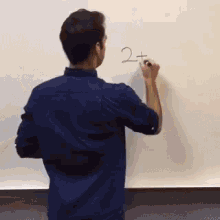

```{r setup, include=FALSE}
knitr::opts_chunk$set(echo = TRUE)
```


### *Attending every class is the first step toward success!*

1. You are paying for the privilege of attending class. Skipping class is a waste  of your tuition dollars.

2. Going to class is an efficient use of your time. It will take you twice as long to find out what you missed, copy someone else's notes, etc., as it would to have gone to class yourself.

3. When you skip, you miss class discussions - a chance to hear other students' questions and ask your own.

4. Someone else's class notes will not make as much sense to you as your own.

5. Lectures often cover materials other than the text.

6. Professors tend to highlight what they consider most important - your clue as to what's likely to be on an exam.

7. Much of your education comes from direct interaction with faculty, not just from reading a textbook. Your professors are experts in their fields with experience to share.

8. You are responsible for all material covered in class, whether you were there or not.

9. Attendance at every class says that you are interested, you want to do well, you value the class and learning is a priority.


### *Why is it important to take notes in class?*


<figure>

</figure>


1. Clear and organized notes will help you identify the core  ideas in the lecture.

2. A permanent record will help you to learn and remember later.

5. Class assignments are usually given in the lecture.

6. The underlying purpose of the lecture will become clear through note taking.


### *How to get ready for an exam?*

1. I would recommend reading [this](https://www.wikihow.com/Prepare-for-an-Exam) article. 

***